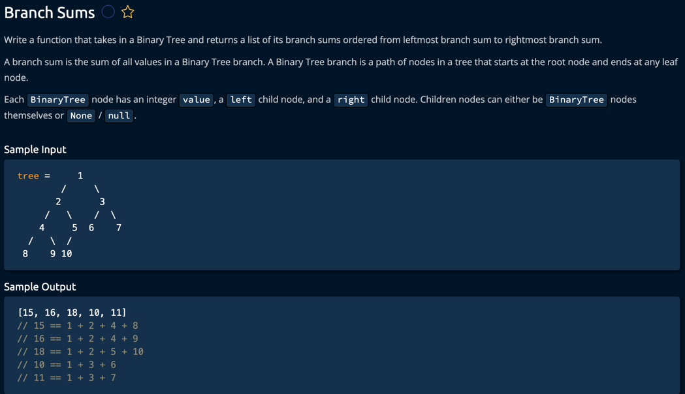

This solution includes:

A BinaryTree class that defines the structure of our tree nodes
The main branchSums function that initializes the process
A helper function calculateBranchSums that does the recursive calculation
An example usage with a sample tree

The algorithm works by:

Starting at the root node
Keeping track of the running sum as we traverse down each path
When we reach a leaf node (no left or right child), we add the final sum to our results array
The results are automatically ordered from leftmost to rightmost due to the order of recursion

The time complexity is O(N) where N is the number of nodes in the tree, as we need to visit each node exactly once.
The space complexity is O(N) due to the recursion stack and the storage of the sums array.