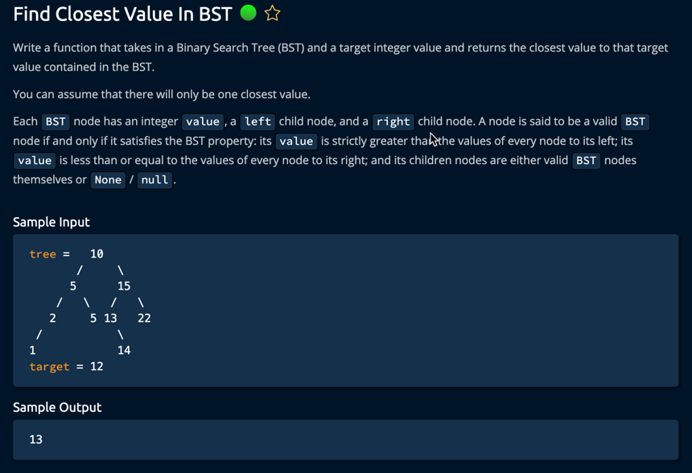

## Approach 1: Binary Search Approach (Optimal Solution)
Time Complexity: O(log n) for balanced BST, O(n) worst case
Space Complexity: O(1)

### Approach 2: Recursive Inorder Traversal
Time Complexity: O(n)
Space Complexity: O(h) where h is height of tree

### Follow-up 1: Find K Closest Values
Time Complexity: O(n)
Space Complexity: O(n)

