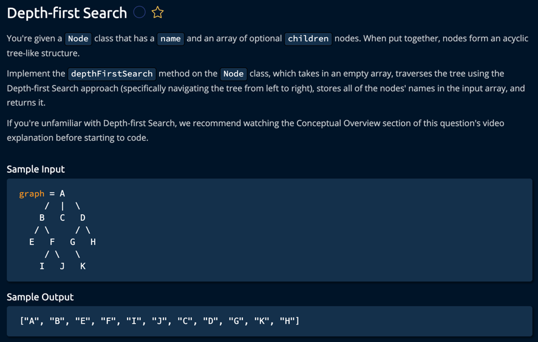

Key Points for Interview:

Time Complexity: O(v + e)

v = number of vertices (nodes)
e = number of edges
We must visit every node and edge once

Space Complexity: O(h)

h = height of tree
Due to recursion stack

Important Concepts:

Pre-order traversal pattern
Recursive approach
Array passed by reference
Left-to-right traversal order

Follow-up Questions to Expect:

How would you implement this iteratively?
How would you handle cycles if this were a graph?
How would you implement breadth-first search?
How would you find the shortest path between two nodes?