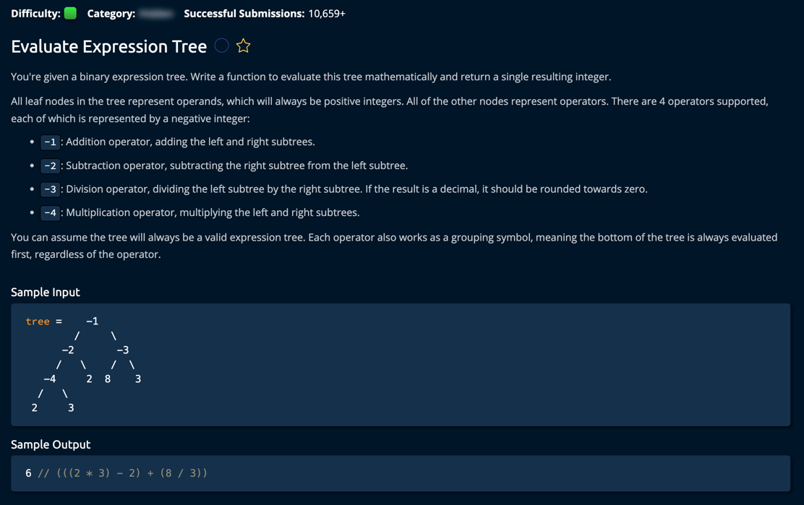

// Key Technical Considerations

1. Edge Cases:
    - Empty tree
    - Division by zero
    - Invalid operators
    - Negative numbers vs operators

2. Time & Space Complexity:
    - Time: O(n) where n is number of nodes
    - Space: O(h) where h is height of tree (recursion stack)
    - Best case: O(log n) for balanced tree
    - Worst case: O(n) for skewed tree

3. Optimization Opportunities:
    - Tail recursion (though JS doesn't optimize for it)
    - Iterative solution using stack
    - Memory optimization for large trees