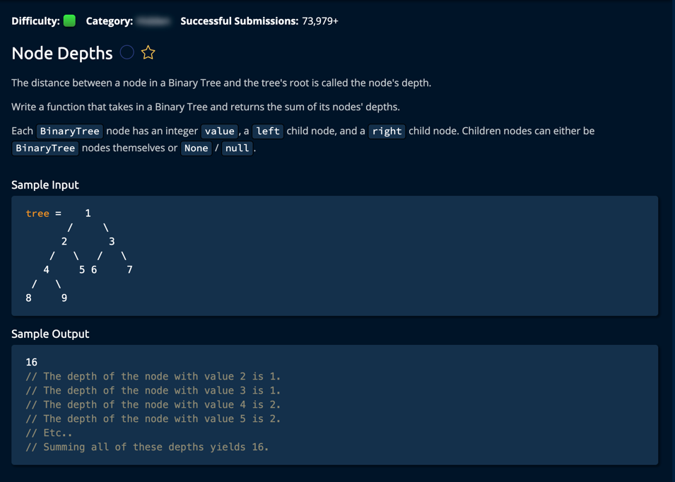

Let me explain the approach to finding the closest value in a BST in plain words:

Initial Understanding

We have a target number we're looking for
We want to find the value in our tree that's closest to this target
"Closest" means the smallest absolute difference between two numbers

Core Strategy

Start at the root of the tree
At each step, we keep track of the closest value we've found so far
Compare the current node's value with our target
Decide whether to go left or right, but only after checking if current value is closest

Step-by-Step Process

Begin at root node
Compare current node's value with target:

Calculate difference between current value and target
If this difference is smaller than our current best, update our answer

Decide which way to go:

If target is smaller than current value, go left
If target is larger than current value, go right
If equal, we've found an exact match (can't get closer than that!)