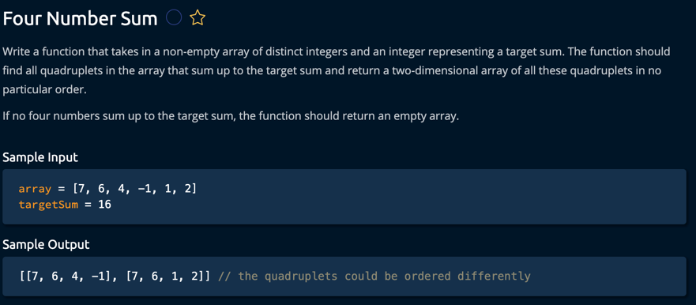

/*
Interview Discussion Points:

1. Time Complexity:
    - Sorted approach: O(n³) in worst case
    - Hash table approach: O(n²) average case, O(n⁴) worst case

2. Space Complexity:
    - Sorted approach: O(1) auxiliary space (excluding output array)
    - Hash table approach: O(n²) for storing pairs

3. Trade-offs:
    - Sorted approach:
        * Better space complexity
        * More predictable performance
        * Handles duplicates efficiently

    - Hash table approach:
        * Better average time complexity
        * Uses more memory
        * May need additional handling for duplicates

4. Optimization techniques used:
    - Sorting to skip duplicates
    - Two-pointer technique
    - Hash table for pair sums
    - Early termination conditions
      */

Time Complexity: O(n³)

Sorting: O(n log n)
Three nested loops: O(n * n * n) = O(n³)
Total: O(n log n + n³) = O(n³)

Space Complexity: O(1)

Only using a constant amount of extra space
Output array not counted in space complexity
Sorting might use O(log n) space depending on implementation

Hash Table Approach:

Time Complexity: Average Case: O(n²)

Outer two loops: O(n²)
Hash table lookups: O(1) average
Total: O(n²)

Worst Case: O(n⁴)

When all pairs sum to the same value
Each pair needs to be compared with all other pairs

Space Complexity: O(n²)

Hash table stores all possible pairs
In worst case, need to store n² pairs

Comparison with Example: